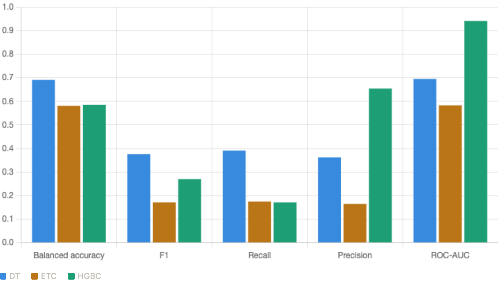
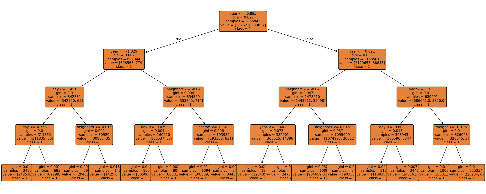

<!-- _class: cover -->

# Clasificadores basados en Árboles de Decisión
Bitcoin Heist Ransomware Address

---
Instituto Politécnico Nacional
Centro de Investigación y de Desarrollo Tecnológico en Cómputo
Aprendizaje Automático — Profesora: Dra. Yenny Villuendas

**Ing. Marco Antonio Reséndiz Díaz**
Maestría en Ciencia y Tecnología en Inteligencia Artificial y Ciencia de Datos

Abril, 2026

---

# Índice

1. Introducción
2. Descripción del conjunto de datos
3. Tratamiento de los datos
4. Desempeño de clasificadores
5. Resultados
6. Conclusiones

---

# 1. Introducción

## ¿Qué es el Ransomware?

> Malware que retiene datos o dispositivos confidenciales de una víctima, amenazando con mantenerlos bloqueados a menos que se pague un rescate.
> — IBM Think

**Ransomware Payment:** pago realizado a ciberdelincuentes para obtener una clave de cifrado.

⚠️ El pago **no siempre** garantiza la liberación de los datos o dispositivos afectados.

---

# 2. Conjunto de datos

**Bitcoin Heist Ransomware Address** — UCI Machine Learning Repository

Diseñado como un **grafo de características** para detectar patrones de transacciones de Bitcoin asociadas a ransomware.

| Feature | Tipo | Descripción |
|---|---|---|
| address | String | Dirección de Bitcoin |
| year / day | Integer | Fecha de la transacción |
| length | Integer | Repeticiones del proceso de mezcla |
| weight | Float | Grado de fusión de monedas |
| count | Integer | Número de transacciones de fusión |
| looped | Integer | Transacciones que dividen, mueven y fusionan monedas |
| neighbors | Integer | Vecinos en el grafo |
| income | Integer | Monto en Satoshi |
| label | String | Familia ransomware o *"white"* |

---

# 2. Conjunto de datos — Features clave

### Length
Cuantifica la cantidad de veces que se repite el proceso de mezcla de Bitcoin para ocultar el origen de las monedas.

### Weight
Mide la **fusión de monedas**: cuando múltiples direcciones de entrada se concentran en una sola salida.

### Looped
Mide transacciones que:
1. Dividen monedas
2. Las mueven por diferentes caminos en la red
3. Las fusionan en una sola cuenta

> **Nota:** Los registros con label *ransomware* son confirmados; los *white* pueden o no estar relacionados.

---

# 3. Tratamiento de los datos

**Periodo:** enero 2009 – diciembre 2018
**Filtro:** transferencias > 0.3 BTC (cantidades menores son raramente ransomware)
**Registros:** **2,916,697**

### Binarización del target

| Label original | Target |
|---|---|
| *"white"* | 0 (posiblemente no ransomware) |
| Cualquier familia ransomware | 1 (confirmado ransomware) |

### Preprocesamiento
- Eliminación de columnas `address` y `label`
- **Escalado** con `StandardScaler` — evita sesgo por magnitudes grandes
- Sin valores nulos en el dataset

---

# 4. Validación

## Validación cruzada estratificada

Combina **k-fold cross validation** con **estratificación**:

- **k-fold:** divide los datos en $k$ subconjuntos; entrena con $k-1$ y valida con el restante
- **Estratificación:** asegura que cada subconjunto mantenga la **misma proporción de clases**

Esto es crítico dado el severo desbalance del dataset.

**Configuración:** `StratifiedKFold(n_splits=5, shuffle=True, random_state=0)`

---

# 4. Clasificadores

| Modelo | Concepto | Parámetros clave |
|---|---|---|
| `DecisionTreeClassifier` | Particiona el espacio de features recursivamente minimizando impureza (Gini) | `criterion="gini"`, `max_depth=None` |
| `ExtraTreeClassifier` | Igual que CART pero con splits aleatorios; diseñado para ensembles | `max_features="sqrt"` |
| `HistGradientBoostingClassifier` | Árboles secuenciales que corrigen el error residual del anterior; usa histogramas para acelerar splits | `learning_rate=0.1`, `max_iter=100` |

Todos implementados con **Pipeline** + `StandardScaler` en scikit-learn.

---

# 5. Resultados

| Métrica | DT | ETC | HGBC |
|---|---|---|---|
| Balanced Accuracy | 0.691 | 0.581 | 0.585 |
| F1 | 0.376 | 0.171 | 0.270 |
| Recall | 0.391 | 0.175 | 0.171 |
| Precision | 0.362 | 0.165 | **0.654** |
| ROC-AUC | 0.695 | 0.583 | **0.941** |
| Fit time (s) | 5.879 | **0.621** | 2.879 |

---

# 5. Resultados — Gráfica comparativa

<!-- Sustituir por la imagen generada -->

*Comparación de métricas de desempeño entre los tres clasificadores.*

---

# 5. Resultados — Visualización DT

<!-- Sustituir por la imagen del árbol -->

*DecisionTreeClassifier con `max_depth=4` para visualización.*

---

# 6. Conclusiones

**Desbalance severo:** 98.62% clase 0 (*white*) vs 1.38% clase 1 (*ransomware*) — factor limitante para todos los modelos.

**ExtraTreeClassifier** replica el problema del k-NN: recall bajo (~17%) y métricas pobres. Como árbol individual con splits aleatorios no supera el sesgo hacia la clase mayoritaria.

**DecisionTreeClassifier** mejora significativamente respecto al k-NN (recall ~39%, balanced accuracy ~69%). Las particiones recursivas capturan mejor la estructura del desbalance que la distancia euclidiana.

**HistGradientBoostingClassifier** — modelo más prometedor:
- ROC-AUC de **0.941** — capacidad discriminativa superior
- Precision de **~65%** — cuando predice ransomware, acierta
- Recall bajo (~17%) por el umbral conservador por defecto

El poder discriminativo existe. Falta calibrar el umbral o aplicar técnicas como SMOTE o `class_weight`.

---

# Gracias

**Referencias**
- IBM Think: https://www.ibm.com/mx-es/think/topics/ransomware
- UCI ML Repository: Bitcoin Heist Ransomware Address Dataset
- scikit-learn Documentation: DecisionTreeClassifier, ExtraTreeClassifier, HistGradientBoostingClassifier