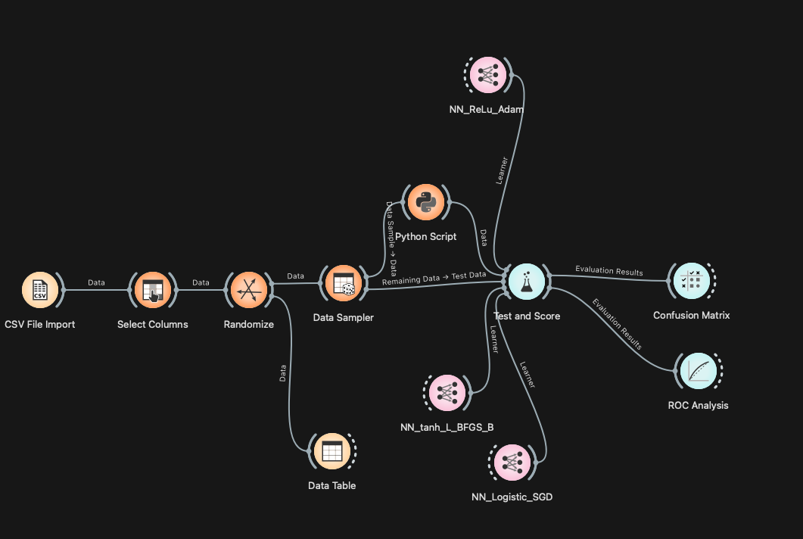
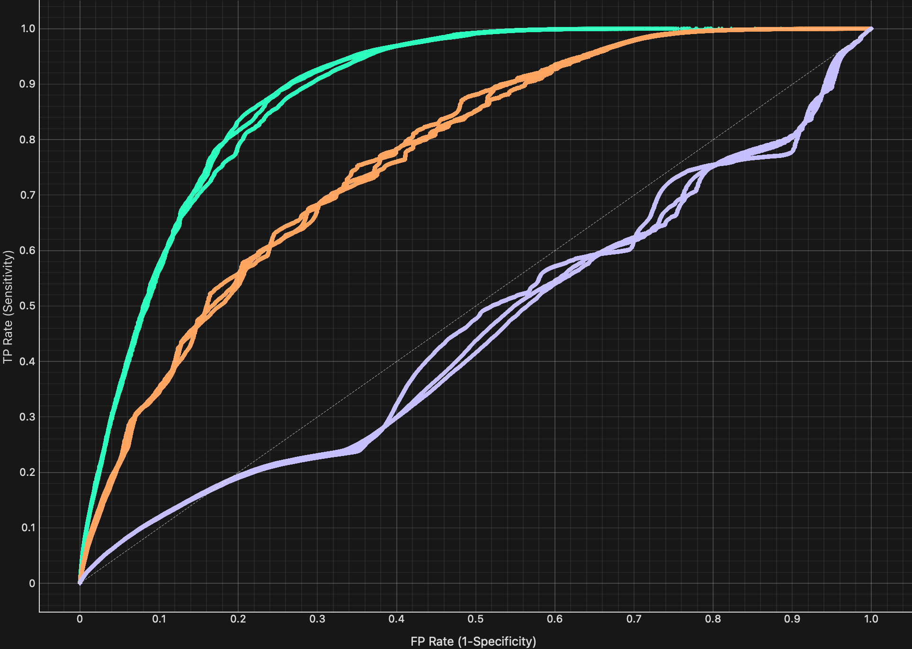

<!-- _class: cover -->

Instituto Politécnico Nacional · CIC 

# Clasificadores basados en Redes Neuronales Artificiales

Bitcoin Heist Ransomware Address Dataset

  
Ing. Marco Antonio Reséndiz Díaz

  

    Maestría en Ciencia y Tecnología en IA y Ciencia de Datos 
    Dra. Yenny Villuendas · Aprendizaje Automático · Mayo 2026
  

₿

---

<!-- _class: index-slide -->

  Índice
  Redes Neuronales Artificiales

  

    
01

    
Introducción

  

  

    
04

    
Desempeño de clasificadores

  

  

    
02

    
Descripción del conjunto de datos

  

  

    
05

    
Resultados

  

  

    
03

    
Tratamiento de los datos

  

  

    
06

    
Conclusiones

  

---

  01 · Introducción
  ¿Qué es el Ransomware?

<blockquote>

<strong>"</strong> Malware que retiene datos o dispositivos confidenciales de una víctima, amenazando con mantenerlos bloqueados a menos que se pague un rescate. <em>— IBM</em>

</blockquote>

  

    
Ransomware Payment

    
Pago realizado a ciberdelincuentes para obtener una clave de cifrado y recuperar el acceso a los datos secuestrados.

  

  

    
⚠ Advertencia crítica

    
El pago <strong>NO siempre</strong> garantiza la liberación de los datos o dispositivos afectados.

  

---

  02 · Conjunto de Datos
  Bitcoin Heist Ransomware Address — UCI ML Repository

  
Diseñado como un <strong>grafo de características</strong> para detectar patrones de transacciones de Bitcoin asociadas a ransomware.

| Feature | Tipo | Descripción |
|---|---|---|
| `address` | String | Dirección de Bitcoin |
| `year / day` | Integer | Fecha de la transacción |
| `length` | Integer | Repeticiones del proceso de mezcla |
| `weight` | Float | Grado de fusión de monedas |
| `count` | Integer | Número de transacciones de fusión |
| `looped` | Integer | Transacciones que dividen, mueven y fusionan monedas |
| `neighbors` | Integer | Vecinos en el grafo de transacciones |
| `income` | Integer | Monto en Satoshi |
| `label` | String | Familia ransomware o *"white"* |

---

  02 · Features Clave
  Anatomía de las transacciones sospechosas

  
LENGTH

  
Cuantifica la cantidad de veces que se repite el proceso de mezcla de Bitcoin para ocultar el origen de las monedas.

  
WEIGHT

  
Mide la <strong>fusión de monedas</strong>: cuando múltiples direcciones de entrada se concentran en una sola salida (coin consolidation).

  
LOOPED

  
Detecta transacciones que <strong>(1)</strong> dividen monedas, <strong>(2)</strong> las mueven por diferentes caminos en la red y <strong>(3)</strong> las fusionan en una sola cuenta.

Nota: Los registros con label <em>ransomware</em> son confirmados; los <em>white</em> pueden o no estar relacionados.

---

  03 · Tratamiento de los Datos
  Preprocesamiento y filtrado

  

    
2,916,697

    
Registros totales filtrados

  

  

    
0.3 BTC

    
Umbral mínimo de transferencia

  

  

    
2009–2018

    
Periodo de análisis

  

  

    
Binarización del Target

    <table>
      <thead><tr><th>Label original</th><th>Target</th></tr></thead>
      <tbody>
        <tr><td class="green">"white"</td><td>0 — posiblemente no ransomware</td></tr>
        <tr><td class="mono">Familia ransomware</td><td>1 — confirmado ransomware</td></tr>
      </tbody>
    </table>
  

  

    
SMOTE — Balanceo

    
<strong style="color:#FF3B5C;">Desbalance severo:</strong> 98.62% clase 0 vs 1.38% clase 1

    

      
98.62% white

      

    

  

---

  03 · Orange Workflow
  Orange

  <figure>
    
  </figure>

---

  04 · Validación
  Validación cruzada estratificada

  
Combina <strong>k-fold cross validation</strong> con <strong>estratificación</strong> para garantizar representatividad de clases en cada subconjunto. Crítico dado el severo desbalance del dataset.

  

    
K-FOLD

    
Divide los datos en k subconjuntos. Entrena con k−1 folds y valida con el restante, rotando hasta cubrir todos.

  

  

    
ESTRATIFICACIÓN

    
Garantiza que cada fold mantenga la misma proporción de clases. Esencial para datasets desbalanceados.

  

  

    
CONFIGURACIÓN

    
<strong>3 folds</strong> para acelerar el entrenamiento. Cada modelo se evalúa en las 3 particiones y se promedia el desempeño.

  

---

  04 · Clasificadores
  Tres modelos basados en Redes Neurnales Artificiales

  

    <h3>RN1_Relu_Adam</h3>
    
Configuración

    

      - Neuronas: 100
      - Activación: ReLU
      - Solver: Adam
      - Regularization: 0.001
      - Max iteraciones: 200
    

  

  

    <h3>RN2_tanh_L_BFGS_B</h3>
    
Configuración

    

      - Neuronas: 100
      - Activación: tanh
      - Solver: L-BFGS-B
      - Regularization: 0.001
      - Max iteraciones: 200
    

  

  

    <h3>RN3_Logistic_SGD</h3>
    
Configuración

    

      - Neuronas: 100
      - Activación: Logistic
      - Solver: SGD
      - Regularization: 0.001
      - Max iteraciones: 200
    

  

Donde:

- Neuronas: Indica que la capa oculta de la red neuronal contiene k neuronas
- Activación: Define la función de activación utilizada por las neuronas para transformar la información recibida
- Solver: Es el algoritmo encargado de optimizar los pesos de la red durante el entrenamiento.
- Regularization: Ayuda a reducir el sobreajuste penalizando pesos excesivamente grandes.
- Max Iteraciones: Número máximo de iteraciones permitidas durante el entrenamiento de la red neuronal

---

  05 · Medidas de Desempeño
  Métricas de evaluación

  

    <h3>Recall</h3>
    
Habilidad de encontrar <strong>todas las muestras positivas</strong>. Mide cuántos ransomwares reales detectamos sobre el total real.

  

  

    <h3>Precision</h3>
    
Habilidad de <strong>no etiquetar positivos como negativos</strong>. Mide la pureza de las alertas generadas.

  

  

    <h3>Accuracy</h3>
    
Proporción de <strong>predicciones correctas</strong> sobre el total de predicciones realizadas.

  

  

    <h3>F1 Score</h3>
    
<strong>Media armónica</strong> entre Precision y Recall. Equilibra ambas métricas en un solo valor representativo.

  

  <h3>AUC-ROC</h3>
  
Área bajo la curva ROC. Mide la capacidad de <strong>distinguir entre clases a diferentes umbrales</strong> de decisión.

---

  05 · Resultados
  Comparación de métricas entre clasificadores

| Modelo            | Train    | AUC   | CA    | F1    | Prec  | Recall |
| ----------------- | -------- | ----- | ----- | ----- | ----- | ------ |
| RN1_Relu_Adam     | 1111.953 | 0.884 | 0.811 | 0.808 | 0.825 | 0.811  |
| RN2_tanh_L_BFGS_B | 2386.158 | 0.768 | 0.687 | 0.686 | 0.691 | 0.687  |
| RN3_Logistic_SGD  | 140.143  | 0.477 | 0.500 | 0.335 | 0.527 | 0.500  |

---

  05 · ROC Analysis
  ROC Analysis

  <figure>
    
  </figure>

---

  05 · Matrices de Confusión
  Distribucion de predicciones por modelo

  

    
RN1_Relu_Adam

    <table style="margin-top:8px;">
      <thead><tr><th></th><th style="text-align:center;color:#94A3B8;font-size:11px;">Pred Neg</th><th style="text-align:center;color:#94A3B8;font-size:11px;">Pred Pos</th></tr></thead>
      <tbody>
        <tr><td style="color:#94A3B8;font-size:11px;">Real Neg</td>
            <td style="text-align:center;background:#001A0D;color:#00FF88;font-size:16px;font-weight:700;font-family:Consolas;">1724197</td>
            <td style="text-align:center;background:#1A0000;color:#FF3B5C;font-size:16px;font-weight:700;font-family:Consolas;">159948</td></tr>
        <tr><td style="color:#94A3B8;font-size:11px;">Real Pos</td>
            <td style="text-align:center;background:#1A0000;color:#FF3B5C;font-size:16px;font-weight:700;font-family:Consolas;">553928</td>
            <td style="text-align:center;background:#001A0D;color:#00FF88;font-size:16px;font-weight:700;font-family:Consolas;">1330217</td></tr>
      </tbody>
    </table>
  

  

    
RN2_tanh_L_BFGS_B

    <table style="margin-top:8px;">
      <thead><tr><th></th><th style="text-align:center;color:#94A3B8;font-size:11px;">Pred Neg</th><th style="text-align:center;color:#94A3B8;font-size:11px;">Pred Pos</th></tr></thead>
      <tbody>
        <tr><td style="color:#94A3B8;font-size:11px;">Real Neg</td>
            <td style="text-align:center;background:#001A0D;color:#00FF88;font-size:16px;font-weight:700;font-family:Consolas;">1416788</td>
            <td style="text-align:center;background:#2A0000;color:#FF3B5C;font-size:16px;font-weight:700;font-family:Consolas;">467357</td></tr>
        <tr><td style="color:#94A3B8;font-size:11px;">Real Pos</td>
            <td style="text-align:center;background:#2A0000;color:#FF3B5C;font-size:16px;font-weight:700;font-family:Consolas;">710745</td>
            <td style="text-align:center;background:#001A0D;color:#00FF88;font-size:16px;font-weight:700;font-family:Consolas;">1173400</td></tr>
      </tbody>
    </table>
  

  

    
RN3_Logistic_SGD

    <table style="margin-top:8px;">
      <thead><tr><th></th><th style="text-align:center;color:#94A3B8;font-size:11px;">Pred Neg</th><th style="text-align:center;color:#94A3B8;font-size:11px;">Pred Pos</th></tr></thead>
      <tbody>
        <tr><td style="color:#94A3B8;font-size:11px;">Real Neg</td>
            <td style="text-align:center;background:#001A0D;color:#00FF88;font-size:16px;font-weight:700;font-family:Consolas;">1881048</td>
            <td style="text-align:center;background:#1D0000;color:#FF3B5C;font-size:16px;font-weight:700;font-family:Consolas;">3097</td></tr>
        <tr><td style="color:#94A3B8;font-size:11px;">Real Pos</td>
            <td style="text-align:center;background:#1D0000;color:#FF3B5C;font-size:16px;font-weight:700;font-family:Consolas;">1880299</td>
            <td style="text-align:center;background:#001A0D;color:#00FF88;font-size:16px;font-weight:700;font-family:Consolas;">3846</td></tr>
      </tbody>
    </table>
  

---

  06 · Conclusiones
  Análisis comparativo de los tres clasificadores

      

      - La configuración RN1 basada en ReLU y Adam obtuvo el mejor desempeño global, alcanzando un AUC de 0.884 y una exactitud de 81.1%, evidenciando una mayor capacidad de discriminación y generalización respecto al resto de configuraciones evaluadas.
      - RN2 presentó un desempeño intermedio, mientras que RN3 mostró resultados cercanos al azar, indicando dificultades de convergencia asociadas al uso de la función logística y el optimizador SGD.
      

      

      - RN2 presentó un desempeño intermedio, mientras que RN3 mostró resultados cercanos al azar, indicando dificultades de convergencia asociadas al uso de la función logística y el optimizador SGD.
      

---

<!-- _class: thankyou -->

🛡

# Gracias

## por su atención

  <strong>Referencias</strong> 
  IBM Think: ibm.com/mx-es/think/topics/ransomware 
  UCI ML Repository: Bitcoin Heist Ransomware Address Dataset

