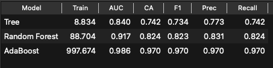
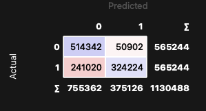
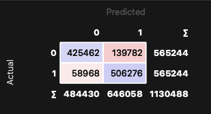
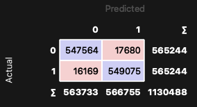
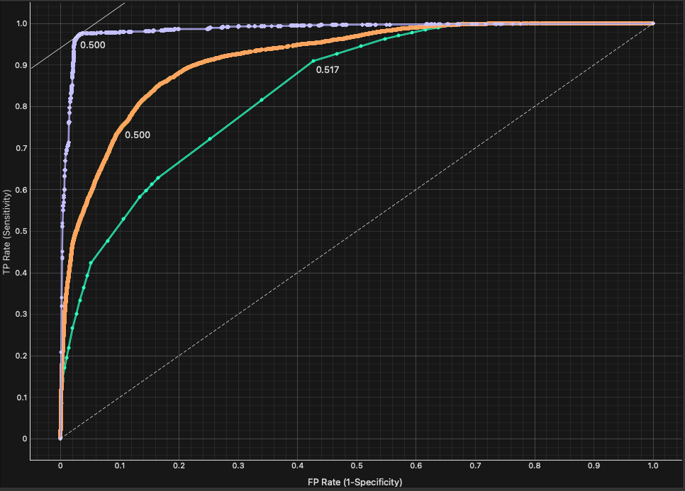

<!-- _class: cover -->

# Clasificadores basados en Reglas de Decisión
Bitcoin Heist Ransomware Address

---
Instituto Politécnico Nacional
Centro de Investigación y de Desarrollo Tecnológico en Cómputo
Aprendizaje Automático — Profesora: Dra. Yenny Villuendas

**Ing. Marco Antonio Reséndiz Díaz**
Maestría en Ciencia y Tecnología en Inteligencia Artificial y Ciencia de Datos

Mayo, 2026

---

# Índice

1. Introducción
2. Descripción del conjunto de datos
3. Tratamiento de los datos
4. Desempeño de clasificadores
5. Resultados
6. Conclusiones

---

# 1. Introducción

## ¿Qué es el Ransomware?

> Malware que retiene datos o dispositivos confidenciales de una víctima, amenazando con mantenerlos bloqueados a menos que se pague un rescate.
> — IBM Think

**Ransomware Payment:** pago realizado a ciberdelincuentes para obtener una clave de cifrado.

⚠️ El pago **no siempre** garantiza la liberación de los datos o dispositivos afectados.

---

# 2. Conjunto de datos

**Bitcoin Heist Ransomware Address** — UCI Machine Learning Repository

Diseñado como un **grafo de características** para detectar patrones de transacciones de Bitcoin asociadas a ransomware.

| Feature | Tipo | Descripción |
|---|---|---|
| address | String | Dirección de Bitcoin |
| year / day | Integer | Fecha de la transacción |
| length | Integer | Repeticiones del proceso de mezcla |
| weight | Float | Grado de fusión de monedas |
| count | Integer | Número de transacciones de fusión |
| looped | Integer | Transacciones que dividen, mueven y fusionan monedas |
| neighbors | Integer | Vecinos en el grafo |
| income | Integer | Monto en Satoshi |
| label | String | Familia ransomware o *"white"* |

---

# 2. Conjunto de datos — Features clave

### Length
Cuantifica la cantidad de veces que se repite el proceso de mezcla de Bitcoin para ocultar el origen de las monedas.

### Weight
Mide la **fusión de monedas**: cuando múltiples direcciones de entrada se concentran en una sola salida.

### Looped
Mide transacciones que:
1. Dividen monedas
2. Las mueven por diferentes caminos en la red
3. Las fusionan en una sola cuenta

> **Nota:** Los registros con label *ransomware* son confirmados; los *white* pueden o no estar relacionados.

---

# 3. Tratamiento de los datos

**Periodo:** enero 2009 – diciembre 2018
**Filtro:** transferencias > 0.3 BTC (cantidades menores son raramente ransomware)
**Registros:** **2,916,697**

### Binarización del target

| Label original | Target |
|---|---|
| *"white"* | 0 (posiblemente no ransomware) |
| Cualquier familia ransomware | 1 (confirmado ransomware) |

### Preprocesamiento
- Eliminación de columnas `address` y `label`
- Sin valores nulos en el dataset

---

# 3.1 Tratamiento de los datos

### SMOTE

**Desbalance severo:** 98.62% clase 0 (*white*) vs 1.38% clase 1 (*ransomware*) — factor limitante para todos los modelos.

Para resolver este problema, se utilizo SMOTE que su objetivo es generar muestras sintéticas de la clase minoritaria. Intuitivamente  asume que si dos transacciones son parecidads entre sí y ambas son ransomware, entonces cualquier punto intermedio entre elllas debería ser ransomware.

NOTA:
- Esto genero que el Conjunto de datos aumentara a ~5.6M, en este experimento se utilizo el 20% (~1.13M)

---

# 4. Validación

## Validación cruzada estratificada

Combina **k-fold cross validation** con **estratificación**:

- **k-fold:** divide los datos en $k$ subconjuntos; entrena con $k-1$ y valida con el restante
- **Estratificación:** asegura que cada subconjunto mantenga la **misma proporción de clases**

Esto es crítico dado el severo desbalance del dataset.

**Configuración:** El conjunto de datos se dividio en 3 folds, para acelerar el entrenamiento

---

# 4.1 Clasificadores

| Modelo | Concepto | Parámetro clave |
|---|---|---|
| **Decision Tree** | Particiona datos jerárquicamente mediante condiciones lógicas hasta clasificar cada grupo | `max_depth` — profundidad máxima del árbol |
| **Random Forest** | Ensamble de árboles construidos en paralelo que votan para dar una predicción final | `n_estimators` — número de árboles |
| **AdaBoost** | Ensamble de árboles construidos secuencialmente donde cada árbol corrige los errores del anterior | `n_estimators` — número de árboles, `learning_rate` — peso de cada corrección |

NOTA: 
- Ninguno de los tres aprende reglas explícitas del tipo if/then como RIPPER o CN2. En cambio, construyen estructuras internas que implícitamente toman decisiones.

---

# 4.2 Medidas de desempeño

| Medida | Descripción |
|---|---|
| `Recall` | Habilidad de encontrar todas las muestras positivas |
| `Precision` | Habilidad de no etiquetar positivos como negativos |
| `Classification Accuracy` | Proporción de predicciones correctas sobre el total |
| `F1` | Media armónica entre precision y recall |
| `AUC` | Área bajo la curva ROC — distingue entre clases a diferentes umbrales |

---

# 5. Resultados

---

# 5.1 Resultados — Confusion Matrix

  <figure>
    
    <figcaption style="text-align: center;">Tree</figcaption>
  </figure>
  <figure>
    
    <figcaption style="text-align: center;">Random Forest</figcaption>
  </figure>
  <figure>
    
    <figcaption style="text-align: center;">AdaBoost</figcaption>
  </figure>

---

# 5.2 Resultados — ROC Analysis

---

# 6. Conclusiones

**AdaBoost** fue el modelo ganador en todas las métricas — detecta el 97.1% de los casos reales de ransomware generando mínimas falsas alarmas (16,169 falsos negativos vs 241,020 del Tree). Su naturaleza secuencial, corrigiendo errores de iteración en iteración, lo hace especialmente efectivo para patrones complejos en datasets desbalanceados.

**Random Forest** es una alternativa sólida cuando la interpretabilidad y el tiempo de entrenamiento son restricciones — su AUC de 0.917 y Recall de 89.6% son resultados muy competitivos con un tiempo de entrenamiento significativamente menor al de AdaBoost.

**Decision Tree** aunque es el más interpretable y rápido, su Recall de 57.3% lo hace insuficiente para detección de amenazas — dejaría sin detectar casi la mitad del ransomware real.

---

# Gracias

**Referencias**
- IBM Think: https://www.ibm.com/mx-es/think/topics/ransomware
- UCI ML Repository: Bitcoin Heist Ransomware Address Dataset