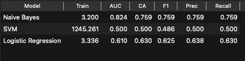
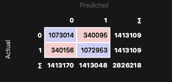
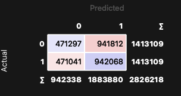
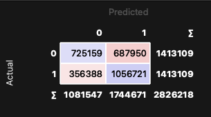

<!-- _class: cover -->

# Clasificadores Probabilísticos y Máquinas de Soporte Vectorial
Bitcoin Heist Ransomware Address

---
Instituto Politécnico Nacional
Centro de Investigación y de Desarrollo Tecnológico en Cómputo
Aprendizaje Automático — Profesora: Dra. Yenny Villuendas

**Ing. Marco Antonio Reséndiz Díaz**
Maestría en Ciencia y Tecnología en Inteligencia Artificial y Ciencia de Datos

Mayo, 2026

---

# Índice

1. Introducción
2. Descripción del conjunto de datos
3. Tratamiento de los datos
4. Desempeño de clasificadores
5. Resultados
6. Conclusiones

---

# 1. Introducción

## ¿Qué es el Ransomware?

> Malware que retiene datos o dispositivos confidenciales de una víctima, amenazando con mantenerlos bloqueados a menos que se pague un rescate.
> — IBM Think

**Ransomware Payment:** pago realizado a ciberdelincuentes para obtener una clave de cifrado.

⚠️ El pago **no siempre** garantiza la liberación de los datos o dispositivos afectados.

---

# 2. Conjunto de datos

**Bitcoin Heist Ransomware Address** — UCI Machine Learning Repository

Diseñado como un **grafo de características** para detectar patrones de transacciones de Bitcoin asociadas a ransomware.

| Feature | Tipo | Descripción |
|---|---|---|
| address | String | Dirección de Bitcoin |
| year / day | Integer | Fecha de la transacción |
| length | Integer | Repeticiones del proceso de mezcla |
| weight | Float | Grado de fusión de monedas |
| count | Integer | Número de transacciones de fusión |
| looped | Integer | Transacciones que dividen, mueven y fusionan monedas |
| neighbors | Integer | Vecinos en el grafo |
| income | Integer | Monto en Satoshi |
| label | String | Familia ransomware o *"white"* |

---

# 2. Conjunto de datos — Features clave

### Length
Cuantifica la cantidad de veces que se repite el proceso de mezcla de Bitcoin para ocultar el origen de las monedas.

### Weight
Mide la **fusión de monedas**: cuando múltiples direcciones de entrada se concentran en una sola salida.

### Looped
Mide transacciones que:
1. Dividen monedas
2. Las mueven por diferentes caminos en la red
3. Las fusionan en una sola cuenta

> **Nota:** Los registros con label *ransomware* son confirmados; los *white* pueden o no estar relacionados.

---

# 3. Tratamiento de los datos

**Periodo:** enero 2009 – diciembre 2018
**Filtro:** transferencias > 0.3 BTC (cantidades menores son raramente ransomware)
**Registros:** **2,916,697**

### Binarización del target

| Label original | Target |
|---|---|
| *"white"* | 0 (posiblemente no ransomware) |
| Cualquier familia ransomware | 1 (confirmado ransomware) |

### Preprocesamiento
- Eliminación de columnas `address` y `label`
- Sin valores nulos en el dataset

---

# 3.1 Tratamiento de los datos

### SMOTE

**Desbalance severo:** 98.62% clase 0 (*white*) vs 1.38% clase 1 (*ransomware*) — factor limitante para todos los modelos.

Para resolver este problema, se utilizo SMOTE que su objetivo es generar muestras sintéticas de la clase minoritaria. Intuitivamente  asume que si dos transacciones son parecidads entre sí y ambas son ransomware, entonces cualquier punto intermedio entre elllas debería ser ransomware.

NOTA:
- Esto genero que el Conjunto de datos aumentara a ~5.6M, en este experimento se utilizo el 20% (~1.13M)
- Dado los tipos de modelos, se escalaron los datos

---

# 4. Validación

## Validación cruzada estratificada

Combina **k-fold cross validation** con **estratificación**:

- **k-fold:** divide los datos en $k$ subconjuntos; entrena con $k-1$ y valida con el restante
- **Estratificación:** asegura que cada subconjunto mantenga la **misma proporción de clases**

Esto es crítico dado el severo desbalance del dataset.

**Configuración:** El conjunto de datos se dividio en 3 folds, para acelerar el entrenamiento

---

# 4.1 Clasificadores

| Modelo | Concepto | Parámetro clave |
|---|---|---|
| **Naive Bayes** | Clasifica calculando la probabilidad de cada clase asumiendo independencia entre features | Sin parámetros clave — usa distribución de probabilidad de los datos |
| **Logistic Regression** | Estima la probabilidad de pertenencia a una clase mediante una función sigmoide | `C` — fuerza de regularización, `max_iter` — iteraciones máximas |
| **Linear SVM** | Encuentra el hiperplano que maximiza el margen de separación entre clases | `C` — penalización por clasificaciones incorrectas |

NOTA:
- En este problema, ninguno de los tres captura adecuadamente la complejidad no lineal del patrón de ransomware, lo que explica su menor desempeño respecto a los modelos basados en árboles.

---

# 4.2 Medidas de desempeño

| Medida | Descripción |
|---|---|
| `Recall` | Habilidad de encontrar todas las muestras positivas |
| `Precision` | Habilidad de no etiquetar positivos como negativos |
| `Classification Accuracy` | Proporción de predicciones correctas sobre el total |
| `F1` | Media armónica entre precision y recall |
| `AUC` | Área bajo la curva ROC — distingue entre clases a diferentes umbrales |

---

# 5. Resultados

---

# 5.1 Resultados — Confusion Matrix

  <figure>
    
    <figcaption style="text-align: center;">Naive Bayes</figcaption>
  </figure>
  <figure>
    
    <figcaption style="text-align: center;">SVM</figcaption>
  </figure>
  <figure>
    
    <figcaption style="text-align: center;">Logistic Regression</figcaption>
  </figure>

---

# 6. Conclusiones

**Naive Bayes** — ganador del experimento
Es el mejor de los tres en todas las métricas a pesar de ser el modelo más simple. Su supuesto de independencia entre features funciona sorprendentemente  bien ysugiere que las features de Bitcoin aportan información independiente entre sí para detectar ransomware.

**Logistic Regression** — resultado moderado
Precision baja (60.5%) significa que genera bastantes falsas alarmas. Recall de 74.8% es aceptable pero insuficiente para detección de amenazas donde queremos detectar la mayor cantidad posible de ransomware real.

**Linear SVM** — peor del experimento
Precision de 50% es equivalente a lanzar una moneda y la mitad de sus alertas son falsas. Esto indica que la frontera de decisión entre ransomware y white no es lineal, por lo que un kernel lineal no es adecuado para este problema.

---

# Gracias

**Referencias**
- IBM Think: https://www.ibm.com/mx-es/think/topics/ransomware
- UCI ML Repository: Bitcoin Heist Ransomware Address Dataset