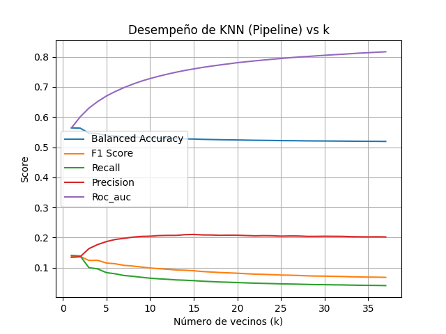

<!-- Portada -->

# Bitcoin Heist Ransomware Address

## Clasificación con k-NN

Ing. Marco Antonio Reséndiz Díaz 
Abril, 2026

---

# Introducción

Se seleccionó el dataset **"Bitcoin Heist Ransomware Address"**, el cual compila un conjunto de **transacciones de Bitcoin**.

Este conjunto de datos está diseñado como un **grafo de características**, para demostrar patrones específicos de transacciones relacionadas con **Ransomware Payments**.

---

## ¿Qué es el Ransomware?

> El ransomware es un tipo de malware que retiene los datos o el dispositivo confidenciales de una víctima, amenazando con mantenerlos bloqueados a menos que la víctima pague un rescate al atacante.
> — IBM

Un **Ransomware Payment** es el pago realizado a los ciberdelincuentes para obtener una clave de cifrado.

⚠️ El pago **no siempre garantiza** la liberación de los datos o dispositivos afectados.

  
  

Referencia: IBM. ¿Qué es el Ransomware? https://www.ibm.com/mx-es/think/topics/ransomware

---

## Descripción del conjunto de datos

| Feature | Tipo | Descripción |
|---|---|---|
| address | String | Dirección de Bitcoin |
| year | Integer | Año |
| day | Integer | Día del año (1–365) |
| length | Integer | Mezcla de Bitcoin |
| weight | Float | Fusión de monedas |
| count | Integer | Número de transacciones |
| looped | Integer | Transacciones en ciclo |
| neighbors | Integer | Vecinos en el grafo |
| income | Integer | Cantidad en Satoshi |
| label | String | Familia ransomware o "white" |

---

## Features: Descripción detallada

**Length** — Cuantifica cuántas veces se repite un proceso de mezcla de Bitcoin, donde las monedas se reparten y reorganizan usando nuevas direcciones para ocultar su origen.

**Weight** — Mide qué tanto ocurre la **fusión de monedas** (más entradas que salidas). Las monedas de varias direcciones se acumulan en una sola.

**Count** — Mide el patrón de fusión en número de transacciones (vs. *weight* que mide la cantidad de monedas).

**Looped** — Mide transacciones que: dividen monedas → las mueven por distintos caminos → las fusionan en una sola cuenta.

---

## Nota sobre los datos

> ✅ Se sabe con certeza que todos los registros con un **label de ransomware** son de hecho transacciones de ese tipo.
>
> ❓ No se sabe del todo si los registros con valor **"white"** están o no relacionados con el ransomware.

---

# Tratamiento de los datos

---

## Preprocesamiento

El conjunto de datos cubre transacciones de **enero 2009 a diciembre 2018**.

- Se utilizó un intervalo de **24 horas**
- Se filtraron transferencias **mayores a 0.3 BTC** (las relacionadas con ransomware raramente son menores)
- Total de registros: **2,916,697**

---

## Etiquetado binario

Cada registro fue etiquetado en la columna `target`:

| Valor | Significado |
|---|---|
| **0** | Tipo "white" — posiblemente no relacionado con ransomware |
| **1** | Ransomware — patrón confirmado |

**Distribución de clases:**

| Clase | Registros | Porcentaje |
|---|---|---|
| 0 (white) | 2,826,218 | **98.62%** |
| 1 (ransomware) | 39,627 | **1.38%** |

---

## Preparación final

Para el entrenamiento se realizaron los siguientes pasos:

- ❌ Se eliminaron las columnas `address` y `label`
- 📏 El conjunto fue **escalado** para evitar sesgo por magnitudes grandes
- ✅ Se conservó como etiqueta principal la columna `target`

> Al hacer el análisis inicial, todos los registros cuentan con todos sus valores en sus características (sin valores nulos).

---

# Metodología

---

## Medidas de desempeño

| Medida | Descripción |
|---|---|
| `recall_score` | Habilidad de encontrar todas las muestras positivas |
| `precision_score` | Habilidad de no etiquetar negativos como positivos |
| `balanced_accuracy_score` | Exactitud balanceada para clases desbalanceadas |
| `f1_score` | Media armónica entre precision y recall |
| `roc_auc_score` | Área bajo la curva ROC — distingue entre clases a diferentes umbrales |

---

## Validación cruzada estratificada

Se utilizó **validación cruzada estratificada** para:

- Evitar que el resultado esté determinado por una selección aleatoria
- Mantener la **proporción de clases** en cada partición

### k-Fold Cross Validation

1. Particionar en **k** subconjuntos
2. Entrenar con **k - 1** subconjuntos
3. Validar con el subconjunto sobrante
4. Reportar el **promedio** de todos los ciclos

### Estratificación

Cada subconjunto conserva aproximadamente el **mismo porcentaje de muestras de cada clase** → esencial para datasets desbalanceados.

---

## Clasificadores utilizados

Los tres modelos son variaciones de `KNeighborsClassifier` de scikit-learn, basados en **distancia euclidiana**:

| Modelo | Configuración |
|---|---|
| k-NN 1 | `n_neighbors=11`, `weights="distance"` |
| k-NN 2 | `n_neighbors=13`, `weights="distance"` |
| k-NN 3 | `n_neighbors=37`, `weights="uniform"` |

---

# Resultados

---

## Comparación de modelos

| Clasificador | Recall | Precision | Bal. Accuracy | F1 | ROC AUC |
|---|---|---|---|---|---|
| k-NN (k=11, distance) | 0.0633 | 0.2067 | 0.5309 | 0.0969 | 0.7356 |
| k-NN (k=13, distance) | 0.0597 | 0.2074 | 0.5282 | 0.0926 | 0.7490 |
| k-NN (k=37, uniform)  | 0.0063 | 0.5782 | 0.5031 | 0.0123 | 0.8313 |

---

## Desempeño k-NN: k = 1 a 37

<!-- Reemplaza la ruta de la imagen -->

---

# Conclusión

---

## Conclusión

El conjunto de datos presenta una **alta complejidad**, principalmente debido al severo **desbalance de clases**:

- Clase *white* (0) → **98.62%**
- Clase *ransomware* (1) → **1.38%**

Este desbalance afecta directamente el desempeño del modelo **k-NN**, que tiende a clasificar la mayoría de los casos como clase mayoritaria, reflejándose en un **recall extremadamente bajo** (~1–6%).

Adicionalmente, la **alta dimensionalidad** del dataset degrada la métrica de distancia utilizada por k-NN, limitando aún más su capacidad de generalización.

---

## Referencias

- IBM. *¿Qué es el Ransomware?* https://www.ibm.com/mx-es/think/topics/ransomware
- UCI ML Repository. *Bitcoin Heist Ransomware Address Dataset.* https://archive.ics.uci.edu/dataset/526/bitcoinheistransomwareaddressdataset
- Scikit-learn. *Metrics API.* https://scikit-learn.org/stable/api/sklearn.metrics.html
- Scikit-learn. *Cross Validation.* https://scikit-learn.org/stable/modules/cross_validation.html
- Scikit-learn. *StratifiedKFold.* https://scikit-learn.org/stable/modules/generated/sklearn.model_selection.StratifiedKFold.html